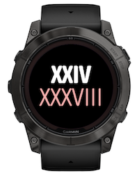

# Garmin Roman Time

A minimalist, elegant, nerdy Garmin watch face that displays the current time as Roman numerals.


Available for installation from [Garmin Connect IQ Developer portal](https://apps-developer.garmin.com/apps/202e7d17-12ca-4112-b94d-da4014b06659) or through the Connect IQ mobile app.

> **Note**  
> Roman Time is part of a [collection of unconventional Garmin watch faces](https://github.com/wkusnierczyk/garmin-watch-faces). It has been developed for fun, as a proof of concept, and as a learning experience.
> It is shared _as is_ as an open source project, with no commitment to long term maintenance and further feature development.
>
> Please use [issues](https://github.com/wkusnierczyk/garmin-roman-time/issues) to provide bug reports or feature requests.  
> Please use [discussions](https://github.com/wkusnierczyk/garmin-roman-time/discussions) for any other comments.
>
> All feedback is wholeheartedly welcome.

## Contents

* [Roman numerals](#roman-numerals)
* [Features](#features)
* [Fonts](#fonts)
* [Build, test, deploy](#build-test-deploy)

## Roman numerals

The Garmin Roman Time watch face shows hours and minutes as [Roman numerals](https://en.wikipedia.org/wiki/Roman_numerals), for the fun of it and for an educational value.

To display hours (0-23) and minutes (0-59), the following Roman digits are used:

| Value | Digit |
|------:|:------|
|     0 | N     |
|     1 | I     |
|     5 | V     |
|    10 | X     |
|    50 | L     |

Roman numerals are formed by adding the values of all digits forming a numeral, with the exception of numerals forming a _subtractive notation_:

| Value | Digits |
|------:|:-------|
|     4 | IV     |
|     9 | IX     |
|    40 | XL     |

Thus, 23:59 is `XXIII LIX`, and 9:44 is `IX XLIV`.

The watch face shows time as:
* either `hours minutes` in one line;
* or `hours` over `minutes`, in two lines.

**Note**  
* The mode can be selected in the app settings, at any time (pun intended), on the watch.
* Due to the size of Roman numerals, the font size in single line mode has tighter limits than in two-line mode. 
Otherwise, the time would at times (pun intended) extend past the boundaries of the watch face. 
In particular, `XXIV XXXVIII` is the longest pair of numeral to be displayed, and it dictates the limit on font size for the single-line mode.


## Features

The Roman Time watch face supports the following features:

|Screenshot|Description|
|-|:-|
||**Single line Roman time**<br/> The current time is displayed as a single line of Roman numerals in two groups: hour, in bold, white font, and minutes, in light, white font.|
||**Double line Roman time**<br/> The current time is displayed as two lines of Roman numerals. The layout can be changed by the user with a Customize menu setting on the device.|


## Fonts

The Roman Time watch face uses custom fonts:

* [Asap Condensed](https://fonts.google.com/specimen/Asap+Condensed) for hours (bold) and minutes (light).

> The development of Garmin watch faces motivated the implementation of two useful tools:
> * A TTF to FNT+PNG converter ([`ttf2bmp`](https://github.com/wkusnierczyk/ttf2bmp)).  
> Garmin watches use non-scalable fixed-size bitmap fonts, and cannot handle variable size True Type fonts directly.
> * An font scaler automation tool ([`garmin-font-scaler`](https://github.com/wkusnierczyk/garmin-font-scaler)).  
> Garmin watches come in a variety of shapes and resolutions, and bitmap fonts need to be scaled for each device proportionally to its resolution.

The font development proceeded as follows:

* The fonts were downloaded from [Google Fonts](https://fonts.google.com/) as True Type  (`.ttf`) fonts.
* The fonts were converted to bitmaps as `.fnt` and `.png` pairs using the open source command-line [`ttf2bmp`](https://github.com/wkusnierczyk/ttf2bmp) converter.
* The font sizes were established to match the Garmin Fenix 7X Solar watch 280x280 pixel screen resolution.
* The fonts were then scaled proportionally to match other screen sizes available on Garmin watches using the [`garmin-font-scaler`](https://github.com/wkusnierczyk/garmin-font-scaler) tool.

The table below lists all font sizes provided for the supported screen resolutions.

| Resolution |    Shape     |       Element       |        Font         | Size |
| ---------: | :----------- | :------------------ | :------------------ | ---: |
|  148 x 205 | rectangle    | Double line hour    | AsapCondensed bold  |   42 |
|  148 x 205 | rectangle    | Double line minutes | AsapCondensed light |   42 |
|  148 x 205 | rectangle    | Single line hour    | AsapCondensed bold  |   32 |
|  148 x 205 | rectangle    | Single line minutes | AsapCondensed light |   32 |
|  176 x 176 | semi-octagon | Double line hour    | AsapCondensed bold  |   50 |
|  176 x 176 | semi-octagon | Double line minutes | AsapCondensed light |   50 |
|  176 x 176 | semi-octagon | Single line hour    | AsapCondensed bold  |   38 |
|  176 x 176 | semi-octagon | Single line minutes | AsapCondensed light |   38 |
|  215 x 180 | semi-round   | Double line hour    | AsapCondensed bold  |   51 |
|  215 x 180 | semi-round   | Double line minutes | AsapCondensed light |   51 |
|  215 x 180 | semi-round   | Single line hour    | AsapCondensed bold  |   39 |
|  215 x 180 | semi-round   | Single line minutes | AsapCondensed light |   39 |
|  218 x 218 | round        | Double line hour    | AsapCondensed bold  |   62 |
|  218 x 218 | round        | Double line minutes | AsapCondensed light |   62 |
|  218 x 218 | round        | Single line hour    | AsapCondensed bold  |   47 |
|  218 x 218 | round        | Single line minutes | AsapCondensed light |   47 |
|  240 x 240 | round        | Double line hour    | AsapCondensed bold  |   69 |
|  240 x 240 | rectangle    | Double line hour    | AsapCondensed bold  |   69 |
|  240 x 240 | round        | Double line minutes | AsapCondensed light |   69 |
|  240 x 240 | rectangle    | Double line minutes | AsapCondensed light |   69 |
|  240 x 240 | round        | Single line hour    | AsapCondensed bold  |   51 |
|  240 x 240 | rectangle    | Single line hour    | AsapCondensed bold  |   51 |
|  240 x 240 | round        | Single line minutes | AsapCondensed light |   51 |
|  240 x 240 | rectangle    | Single line minutes | AsapCondensed light |   51 |
|  260 x 260 | round        | Double line hour    | AsapCondensed bold  |   74 |
|  260 x 260 | round        | Double line minutes | AsapCondensed light |   74 |
|  260 x 260 | round        | Single line hour    | AsapCondensed bold  |   56 |
|  260 x 260 | round        | Single line minutes | AsapCondensed light |   56 |
|  280 x 280 | round        | Double line hour    | AsapCondensed bold  |   80 |
|  280 x 280 | round        | Double line minutes | AsapCondensed light |   80 |
|  280 x 280 | round        | Single line hour    | AsapCondensed bold  |   60 |
|  280 x 280 | round        | Single line minutes | AsapCondensed light |   60 |
|  320 x 360 | rectangle    | Double line hour    | AsapCondensed bold  |   91 |
|  320 x 360 | rectangle    | Double line minutes | AsapCondensed light |   91 |
|  320 x 360 | rectangle    | Single line hour    | AsapCondensed bold  |   69 |
|  320 x 360 | rectangle    | Single line minutes | AsapCondensed light |   69 |
|  360 x 360 | round        | Double line hour    | AsapCondensed bold  |  103 |
|  360 x 360 | round        | Double line minutes | AsapCondensed light |  103 |
|  360 x 360 | round        | Single line hour    | AsapCondensed bold  |   77 |
|  360 x 360 | round        | Single line minutes | AsapCondensed light |   77 |
|  390 x 390 | round        | Double line hour    | AsapCondensed bold  |  111 |
|  390 x 390 | round        | Double line minutes | AsapCondensed light |  111 |
|  390 x 390 | round        | Single line hour    | AsapCondensed bold  |   84 |
|  390 x 390 | round        | Single line minutes | AsapCondensed light |   84 |
|  416 x 416 | round        | Double line hour    | AsapCondensed bold  |  119 |
|  416 x 416 | round        | Double line minutes | AsapCondensed light |  119 |
|  416 x 416 | round        | Single line hour    | AsapCondensed bold  |   89 |
|  416 x 416 | round        | Single line minutes | AsapCondensed light |   89 |
|  454 x 454 | round        | Double line hour    | AsapCondensed bold  |  130 |
|  454 x 454 | round        | Double line minutes | AsapCondensed light |  130 |
|  454 x 454 | round        | Single line hour    | AsapCondensed bold  |   97 |
|  454 x 454 | round        | Single line minutes | AsapCondensed light |   97 |


## Build, test, deploy

To modify and build the sources, you need to have installed:

* [Visual Studio Code](https://code.visualstudio.com/) with [Monkey C extension](https://developer.garmin.com/connect-iq/reference-guides/visual-studio-code-extension/).
* [Garmin Connect IQ SDK](https://developer.garmin.com/connect-iq/sdk/).

Consult [Monkey C Visual Studio Code Extension](https://developer.garmin.com/connect-iq/reference-guides/visual-studio-code-extension/) for how to execute commands such as `build` and `test` to the Monkey C runtime.

You can use the included `Makefile` to conveniently trigger some of the actions from the command line.

```bash
# build binaries from sources
make build

# run unit tests -- note: requires the simulator to be running
make test

# run the simulation 
make run

# clean up the project directory
make clean
```

To sideload your application to your Garmin watch, see [developer.garmin.com/connect-iq/connect-iq-basics/your-first-app](https://developer.garmin.com/connect-iq/connect-iq-basics/your-first-app/).
